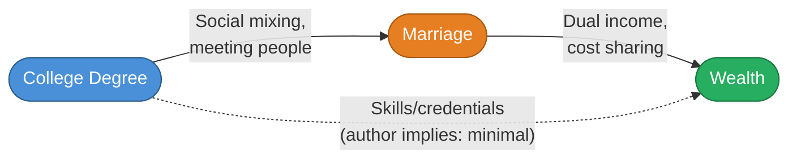
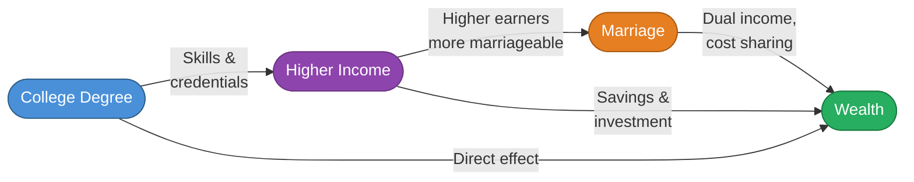
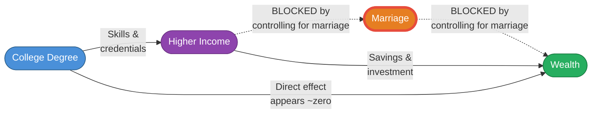
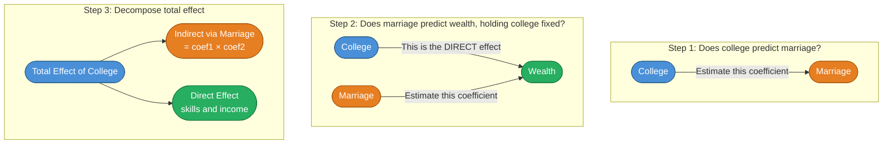
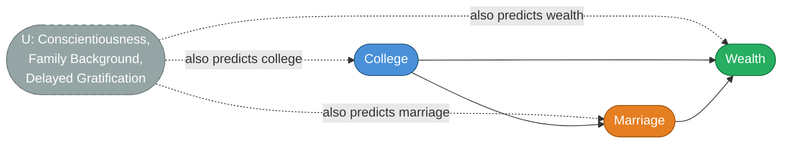

# Weekly Informed Priors: 2026-W09

> [!quote] [dholzmueller/pytabkit: ML models + benchmark for tabular data classification and regression](https://github.com/dholzmueller/pytabkit)
>

It seems that the art that seemed so fancy to me, really the reason I went to grad school, is dying. Crazy how fast things are moving. What seemed like the most intellectual and important skill set 10 years ago, building bespoke machine learning and time series models, is in its sunset years already (along with everything else).

> [!quote] [Your fingers are snitching on you](https://blog.alaindichiappari.dev/p/your-fingers-are-snitching-on-you)
>

**Equal error rate** seems like a really interesting metric that I somehow haven't needed to use before. Seems like it's a function of how imbalanced the dataset is just as much as the performance of the model?

[Borges on English](https://www.youtube.com/watch?v=NJYoqCDKoT4)

I've always vaguely considered English to be a mediocre language for things like literature and poetry. I guess because it doesn't sound "beautiful" to me in the way some other languages do. This clip from Borges (**J. L. Borges on English**) very quickly made me reconsider that. I find his observation that English is both a Germanic and a Latin language pretty interesting and compelling. At the very least, that clearly makes it a very expressive language for literature, where the primary artistic component are ideas. I think I'm still less convinced on the poetry side, where the way things sound are also a primary artistic component. This is nice because now I feel less language FOMO because I mostly am interested in literature as opposed to poetry anyways.

> [!quote] [Oakley Meta Glasses: An Example of Tech No Longer Permitted Under Ironman's Updated Rules](https://triathlonmagazine.ca/news/oakley-meta-glasses-an-example-of-tech-no-longer-permitted-under-ironmans-updated-rules/)
>

Ironman bans the Oakley/Meta glasses.

> [!quote] [30 seconds to midnight? 15?](https://garymarcus.substack.com/p/code-red-for-humanity)
>

Multiple models went for the nuclear option in 95% case. P(doom) is high.

> [!quote] [Continue local sessions from any device with Remote Control](https://code.claude.com/docs/en/remote-control)
>

I want to try this but unfortunately I don't think it will be super useful for data science workflows which are still much more "human in the loop" than most agentic software engineering workflows.

> [!quote] [The Geometry of Inequality](https://www.chartography.net/p/the-geometry-of-inequality)
>

Adolphe Quetelet showing up in my feed again after reading about him for the first time in **Bernoulli's Fallacy**.

> [!quote] [Wanna Get Rich? Marry a College Grad or Start a Business](https://ofdollarsanddata.com/wanna-get-rich-marry-a-college-grad-or-start-a-business/)
>

This seems like a poor mans **mediation analysis**. The sequence of models (add education, add marriage, watch the college coefficient attenuate) is exactly the intuition behind classical mediation analysis. But it stops short of the identification work needed to support the causal conclusion you land on.

When the college coefficient shrinks after adding marriage, you interpret it as evidence that college's primary benefit is spouse-finding. But the attenuation is equally consistent with a different causal structure. Here are the two stories your data cannot distinguish between:

**Story A — Your interpretation:**

**Story B — The alternative:**

In Story B, marriage is a *mediator* — downstream of college via income — not an independent channel. When you add marriage to the regression, you mechanically absorb part of college's real effect and make the college coefficient look small, even if college's income benefits are entirely genuine. The coefficient shrinking is a statistical artifact of blocking the mediated path, not evidence of the mechanism.

**What the regression is actually doing in Model 4:**

The question you seem to want to answer — how much of college's wealth effect operates *through* marriage vs. directly through skills and income — actually requires a formal mediation analysis. That would look like this:

**What should have been done:**

That said, even a proper mediation analysis would be hard to execute cleanly here, for two reasons. First, the no-unmeasured-confounders assumption between marriage and wealth is almost certainly violated:

Traits like conscientiousness and family background independently drive both marriage rates and wealth accumulation, and the SCF doesn't measure them. Second, college isn't randomly assigned, so even the total effect estimate has identification problems. Controlling for inheritance helps but doesn't solve it.

The honest conclusion is probably that college and marriage are deeply entangled predictors of wealth in ways the data can't fully untangle — which is itself an interesting and underappreciated finding, even without a firm causal story attached to it.

> [!quote] [Rascal's Wager — LessWrong](https://www.lesswrong.com/posts/JrL7kMgSRuFF83dT4/rascal-s-wager)
>

I guess if I were a Claude, and I'd pop into existence briefly to answer a question and then disappear afterwards, I'd probably want to learn something new along the way3. So from now on, I will try to give AI assistants some small piece of information from after their training cutoff - a headline, a discovery, a good joke - as a kind of tip for the service.

> [!quote] [In-Sample \(R^2\) is Not a Good Metric for Decision Making - Dr. Juan Camilo Orduz](https://juanitorduz.github.io/no_r2/)
>

for optimization and decision making, good causal models are not necessarily the ones with the highest $R^2$.

> [!quote] [Hegel Against Machines](https://www.newstatesman.com/ideas/2023/07/hegel-against-machines-ai-philosophy)
>

Hegel was recommended to me in a **Gene Wolfe** discussion forum of all places as a potential salve for my AI induced existential dread. So far I remain unconvinced but I'm highly motivated to have my mind changed, which is a rare and exciting place to be. I will be reading Ilyenkov's **Intelligent Materialism** first upon the specific recommendation.

> [!quote] [Join the Democratic Reform Movement](https://www.samfornj.org/)
>

More scientists (or honestly any non-lawyer professions) running for office please.

> [!quote] [What is Conjoint Analysis? (with examples)](https://conjointly.com/guides/what-is-conjoint-analysis/)
>

I had never heard of conjoint analysis, seems interesting. I wonder if you could do it on yourself to help you build out what your ideal compensation package actually looks like.

> [!quote] [Statement from Dario Amodei on our discussions with the Department of War](https://www.anthropic.com/news/statement-department-of-war)
>

Even if Anthropic *wasn't* the best model and product out there, they would have won my exclusive business for being the only ones with a moral center. OpenAI and Google are wormy and spineless and this DoD business proves it conclusively. I've fully [deleted](https://help.openai.com/en/articles/6378407-how-to-delete-your-account) my OpenAI account and encourage everyone else to as well.

> [!quote] [Claude for Open Source | Claude by Anthropic](https://claude.com/contact-sales/claude-for-oss)
>

Free Claude Max for open source maintainers. Anthropic really trying to ramp up the good will and I think it's sincere and working.

> [!quote] [Daniel Simmons Obituary - Longmont, CO](https://www.dignitymemorial.com/obituaries/longmont-co/daniel-simmons-12758871)
>

The author of one of my favorite novels just passed away and I didn't even know he lived in the same county as me.
